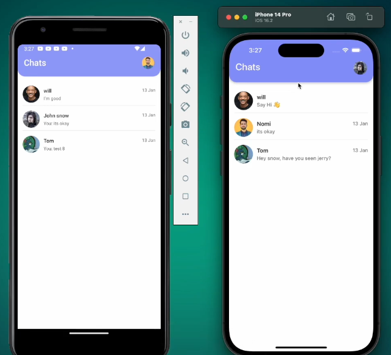

# Chat App

A real-time mobile chat application built with React Native, Expo, and Firebase. Users can view conversations, open chat rooms, and send messages instantly.

## Screenshot



## Features

- Real-time messaging
- User-to-user chat rooms
- Last message preview
- Profile image support
- Firebase Firestore integration
- Responsive mobile UI

## Technologies Used

- React Native
- Expo
- Firebase Firestore
- Expo Image
- React Native Responsive Screen
- NativeWind / Tailwind CSS

## Installation

Clone the project:

```bash
git clone your-repository-url